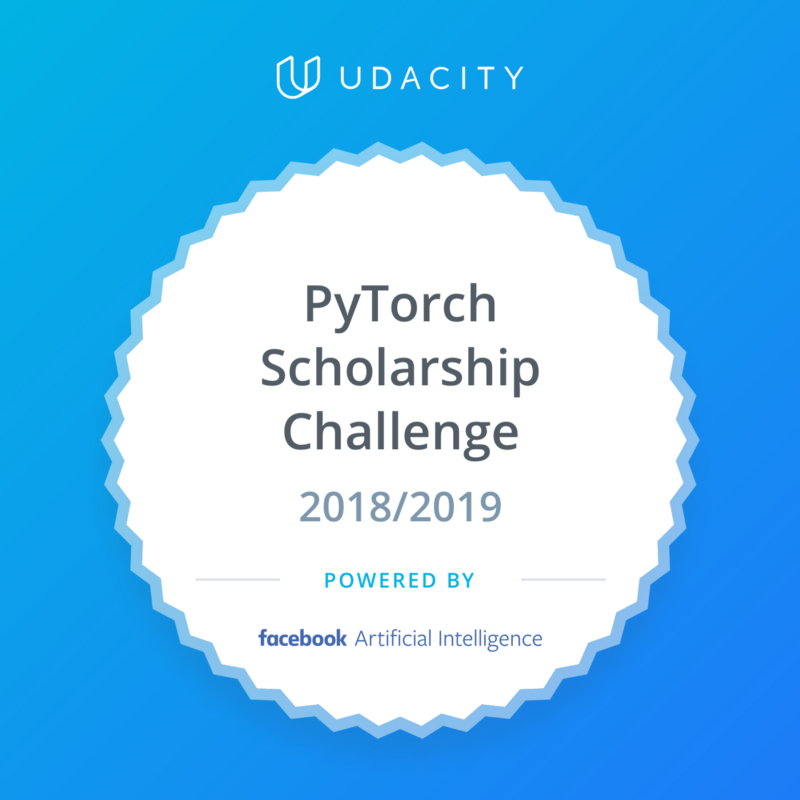

# Deep Learning Nanodegree Projects

  

A collection of projects on Deep Reinforcement Learning Nanodegree [PyTorch Scholarship Challenge Phase 3 2019].

Contributions are always welcome!

## [Project 1: Navigation](https://github.com/agungsantoso/deep-reinforcement-learning-nanodegree-projects/tree/master/p1)

## [Project 2: Continuous Control](https://github.com/agungsantoso/deep-reinforcement-learning-nanodegree-projects/tree/master/p2)

## [Project 3: Collaboration and Competition](https://github.com/agungsantoso/deep-reinforcement-learning-nanodegree-projects/tree/master/p3)