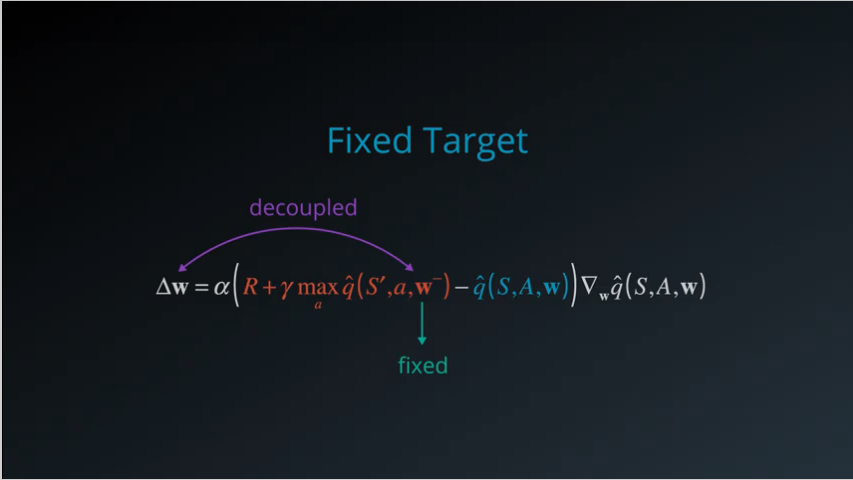

# Project 1: Navigation

## Learning Algorithm

### Deep Q-Networks

Unlike a traditional reinforcement learning setup where only one Q value is produced at a time, the Deep Q network is designed to produce a Q value for every possible action in a single forward pass. These innovative inputs and output transformations support a powerful yet simple neural network architecture under the hood.

The screen images are first processed by convolutional layers. This allows the system to exploit spatial relationships, and can sploit spatial rule space. Also, these convolutional layers extract some temporal properties across those frames. The original DQN agent used three such convolutional layers with ReLu activation, regularized linear units.

    

They were followed by one fully-connected hidden layer with ReLu activation and one fully-connected linear output layer that produced the vector of action values.

    

There are situations where the network weights can oscillate or diverge, due to the high correlation between actions and states.
This can result in a very unstable and ineffective policy.

To overcome these challenges, the researchers came up with several techniques that slightly modified the base Q learning algorithm i.e. experience replay, and fixed Q targets.

### Experience Replay

The idea of experience replay was originally proposed to make more efficient use of observed experiences. To learn more from experienced tuples, it must be stored somewhere. Some states are pretty rare to come by and some actions can be pretty costly, so it would be nice to recall such experiences.

That is exactly what a replay buffer allows us to do. Store each experienced tuple in this buffer as it interacting with the environment and then sample a small batch of tuples from it to learn.

As a result, now it is possible to learn from individual tuples multiple times, recall rare occurrences, and in general make better use of fire experience.

From the experiences being obtained, it realizes that every action affects the next state in some way, which means that a sequence of experienced tuples can be highly correlated.

With experience replay, it is possible to sample from this buffer at random. It doesn't have to be in the same sequence as it stored. This helps break the correlation and ultimately prevents action values from oscillating or diverging catastrophically.

    

This approach is building a database of samples and then learning a mapping from them. In that sense, experience replay helps us reduce the reinforcement learning problem or at least value the learning portion of it to a supervised learning scenario.

It can then apply other models learning techniques and best practices developed in the supervised learning literature through reinforcement learning. The improvement upon this idea, for example,
by prioritizing experience tuples that are rare or more important.

### Fixed Q-Targets

There is another kind of correlation that Q-learning is susceptible to. Q-learning is a form of Temporal Difference or TD learning. And our goal is to reduce the difference between target and the currently predicted Q-value.

The TD target here is supposed to be a replacement for the true value function which is unknown to us. It is not dependent on our function approximation or its parameters, thus resulting in a simple derivative, an update rule. But, our TD target is dependent on these parameters which means simply replacing the true value function with a target like this is mathematically incorrect.

    

It can affect learning significantly when using function approximation, where all the Q-values are intrinsically tied together through the function parameters. Here, the correlation is between the target and the changing parameters. This is like chasing a moving target, literally.

    

What can be done is by fixing the function parameters used to generate our target. The fixed parameters are don't change during the learning step. This decouples the target from the parameters, makes the learning algorithm much more stable, and less likely to diverge or fall into oscillations.

    

### Deep Q-Learning Algorithm

Two main processes are interleaved in this algorithm.

* One, is sampling the environment by performing actions and store away the observed experienced tuples in a replay memory.
* The other is selecting the small batch of tuples from this memory, randomly, and learn from that batch using a gradient descent update step.

    

These two processes are not directly dependent on each other. So, it could perform multiple sampling steps then one learning step, or even multiple learning steps with different random batches.

The rest of the algorithm is designed to support these steps.

* In the beginning, initialize an empty replay memory. Because memory is finite, something like a circular Q is used to retains the N most recent experience tuples.
* Then, Initialize the parameters or weights of the neural network. Sample the weights randomly from a normal distribution with variance equal to two by the number of inputs to each neuron.
* To use the fixed Q targets technique, the second set of parameters is needed which can be initialized. 
* For each episode and each time step within that episode, a raw screen image or input frame x need to be converted to grayscale, crop to a square size, etc.. 
* To capture temporal relationships, stack a few input frames to build each state vector.

    

### Hyperparameters

In this project replay buffer size is set to `100,000`. I use `64` minibatch size with `0.99` discount factor. For the soft update of target parameters `0.003` is used. The learning rate is `0.0005` and the network update every `4` timesteps.

## Plot of Rewards

    

The image above is a plot of rewards per episode to illustrate that the agent can receive an average reward (over `500` episodes) of `+13`.

    

From `Navigation.ipynb` can be seen that the number of episodes needed to solve the environment is 472 episodes.

## Ideas for Future Work

My future ideas for improving the agent's performance:

* Optimize hyperparameters to achieve better results.
* Try to implementing __Rainbow DQN__ on this project.