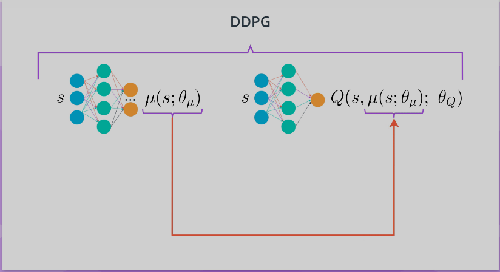
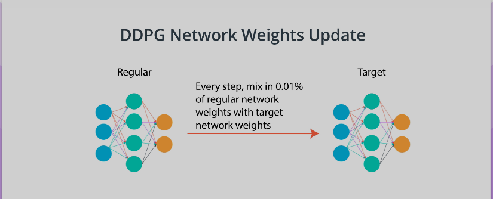
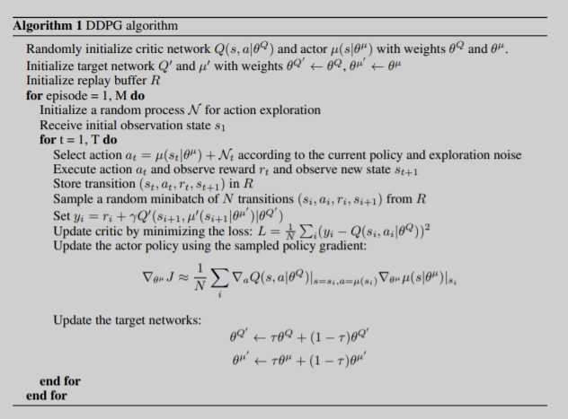
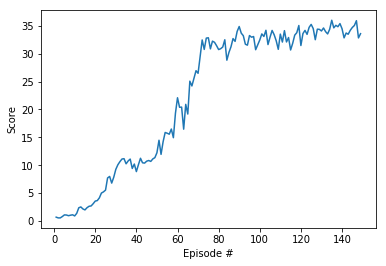
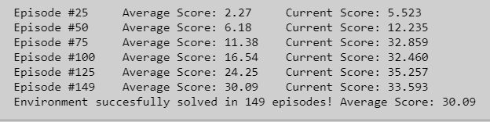

# Project 2: Continous Control

# Learning Algorithm
The report clearly describes the learning algorithm, along with the chosen hyperparameters. It also describes the model architectures for any neural networks.

## DDPG (Deep Deterministic Policy Gradient)

DDPG is a different kind of actor-critic method. In fact, it could be seen as approximate DQN, instead of an actual actor critic. The reason for this is that the critic in DDPG, is used to approximate the maximizer over the Q values of the next state, and not as a learned baseline. 

    

In DDPG, we use two deep neural networks. We can call one the actor and the other the critic. The actor here is used to approximate the optimal policy deterministically. That means we want to always output the best believed action for any given state. This is unlike a stochastic policies in which we want the policy to learn a probability distribution over the actions. In DDPG, we want the believed best action every single time we query the actor network. That is a deterministic policy. The critic learns to evaluate the optimal action value function by using the actors best believed action. 

    

Two other interesting aspects of DDPG are first, the use of a replay buffer, and second, the soft updates to the target networks. In DQN, you have two copies of your network weights, the regular and the target network. In DDPG, there are two copies of your network weights for each network, a regular for the actor, an irregular for the critic, and a target for the actor, and a target for the critic. In DDPG, the target networks are updated using a soft updates strategy. A soft update strategy consists of slowly blending the regular network weights with the target network weights. So, every time step the target network be 99.99 percent of the target network weights and only a 0.01 percent of the regular network weights. There are slowly mix in the regular network weights into the target network weights. 

### DDPG Learning Algorithm

    

### Model Architectures
#### Actor
- Consists of 3 fully connected layer:
    - Fully connected layer 1 - input: 33 (state size), output: 400
    - Fully connected layer 2 - input: 400, output 300
    - Fully connected layer 3 - input: 300, output: 4 (action size)
    - Fully connected layer 1 and 2 is activated by ReLU and tanh is applied to fully connected layer 3

#### Critic
- Consists of 3 Fully connected layer:
    - Fully connected layer 1 - input: 33 (state size), output: 400
    - Fully connected layer 2 - input: 404 (400 + 4 action size), output 300
    - Fully connected layer 3 - input: 300, output: 1
    - Fully connected layer 1 and 2 is activated by ReLU and fully connected layer 3 does not activate

### Hyperparameters

* BUFFER_SIZE = int(1e5)  # replay buffer size
* BATCH_SIZE = 128        # minibatch size
* GAMMA = 0.99            # discount factor
* TAU = 1e-3              # for soft update of target parameters
* LR_ACTOR = 1e-4         # learning rate of the actor 
* LR_CRITIC = 1e-3        # learning rate of the critic
* WEIGHT_DECAY = 0        # L2 weight decay

# Plot of Rewards

    

The image above is a plot of rewards per episode to illustrate the agent is able to receive an average reward (over 100 episodes, and over all 20 agents) of `+30.09`.

    

From the image above can be seen that the number of episodes needed to solve the environment is 149 episodes.

# Ideas for Future Work
The submission has concrete future ideas for improving the agent's performance.

Try to improving the agent's performance using below algorithms:

* A3C (Asynchronous Advantage Actor-Critic)
* A2C (Advantage Actor-Critic)
* GAE (Generalized Advantage Estimation)