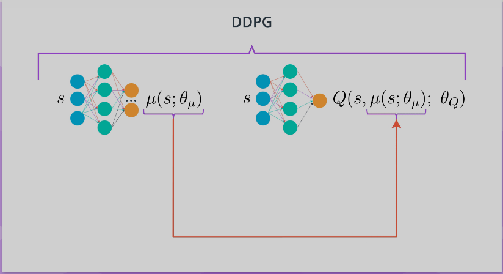
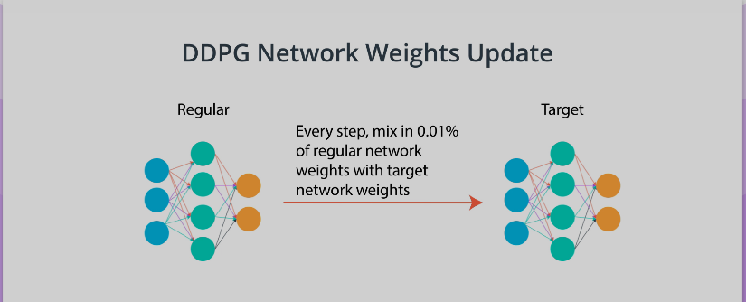
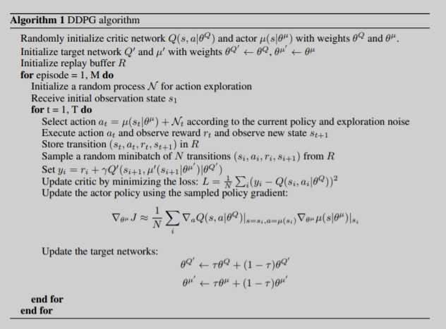
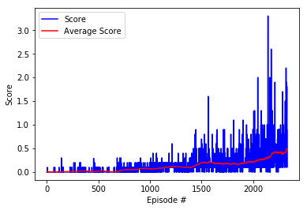
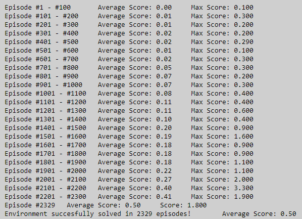

# Project 3: Collaboration and Competition

## Learning Algorithm

## Multi-Agent Systems

Real world intelligence is a result of interactions with multiple agents over lifetime. To build intelligent agents that are used in the real world, they have to interact with humans, which are just another agent, and also with other agents. This leads to a multi-agent scenario. To solve the problem of intelligence, agents should be able to achieve their goals in very complex environments. The multi-agent case is a very complex kind of environment because all the agents are learning simultaneously and also interacting with one another. Just like in real life, there are different kinds of interactions going on between agents, from coordination to competition, to communication, to prediction, negotiation, and so on. 

Some potential real-life applications of multi-agent systems: 

* A group of drones or robots whose aim is to pick up a package and drop it to the destination is a multi-agent system. 
* In the stock market, each person who is trading can be considered as an agent and the profit maximization process can be modeled as a multi-agent problem. 
* Interactive robots or humanoids that interact with humans and get some task done are nothing but multi-agent systems if we consider humans to be agents. 
* Windmills in a wind farm can be thought of as multiple agents. It would be cool if all the agents, that is, the wind turbines figured out the optimal direction to face by themselves, and obtained maximum energy from the wind farm. The aim here is to collaboratively maximize the profit obtained from the wind farm.

Having multiple agents in a system brings in a few benefits:

* The agents can share their experiences with one another making each other smarter, just as we learned from our teachers and friends. However, when agents want to share, they have to communicate, which leads to a cost of communication, like extra hardware and software capabilities. 
* A multi-agent system is robust. Agents can be replaced with a copy when they fail. Other agents in the system can take over the tasks of the failed agent, but the substituting agent now has to do some extra work. 
* Scalability comes by virtue of design, as most multi-agent systems allow insertion of new agents easily. But, if more agents are added to the system, the system becomes more complex than before. So, it depends on the assumptions made by the algorithm and the software-hardware capabilities of the agents, whether or not these advantages will be exploited.

## DDPG (Deep Deterministic Policy Gradient)

DDPG is a different kind of actor-critic method. In fact, it could be seen as approximate DQN, instead of an actual actor critic. The reason for this is that the critic in DDPG, is used to approximate the maximizer over the Q values of the next state, and not as a learned baseline. 

    

In DDPG, we use two deep neural networks. We can call one the actor and the other the critic. The actor here is used to approximate the optimal policy deterministically. That means we want to always output the best believed action for any given state. This is unlike a stochastic policies in which we want the policy to learn a probability distribution over the actions. In DDPG, we want the believed best action every single time we query the actor network. That is a deterministic policy. The critic learns to evaluate the optimal action value function by using the actors best believed action. 

    

Two other interesting aspects of DDPG are first, the use of a replay buffer, and second, the soft updates to the target networks. In DQN, you have two copies of your network weights, the regular and the target network. In DDPG, there are two copies of your network weights for each network, a regular for the actor, an irregular for the critic, and a target for the actor, and a target for the critic. In DDPG, the target networks are updated using a soft updates strategy. A soft update strategy consists of slowly blending the regular network weights with the target network weights. So, every time step the target network be 99.99 percent of the target network weights and only a 0.01 percent of the regular network weights. There are slowly mix in the regular network weights into the target network weights. 

### DDPG Learning Algorithm

    

### MADDPG (Multi Agents DDPG)

This about adapting the single-agent auto techniques DDPG to the multi-agent case. Two extreme approaches come to mind: 

* The simplest approach should be to train all the agents independently without considering the existence of other agents. 

    In this approach, any agent considers all the others to be a part of the environment and learns its own policy. Since all are learning simultaneously, the environment as seen from the prospective of a single agent, changes dynamically. This condition is called non-stationarity of the environment. In most single agent algorithms, it is assumed that the environment is stationary, which leads to certain convergence guarantees. Hence, under non-stationarity conditions, these guarantees no longer hold. 
    
* The second approach is the matter agent approach. The matter agent approach takes into account the existence of multiple agents. 

    Here, a single policy is lowered for all the agents. It takes as input the present state of the environment and returns the action of each agent in the form of a single joint action vector. Typically, a single reward function given the environment state and the action vector returns a global reward. The joint action space would increase exponentially with the number of agents. If the environment is partially observable or the agents can only see locally, each agent will have a different observation of the environment state, hence it will be difficult to disambiguate the state of the environment from different local observations. So this approach works well only when each agent knows everything about the environment.

In this project [this paper](https://papers.nips.cc/paper/7217-multi-agent-actor-critic-for-mixed-cooperative-competitive-environments.pdf) is chosen to implements a multi-agent version of DDPG. DDPG, is an off policy actor-critic algorithm that uses the concept of target networks. The input of the action network is the current state while the output is a real value or a vector representing an action chosen from a continuous action space. 

### Model Architectures
#### Actor
- Consists of 3 fully connected layer:
    - Fully connected layer 1 - input: 576 (state size squared), output: 256
    - Fully connected layer 2 - input: 256, output 128
    - Fully connected layer 3 - input: 128, output: 2 (action size)
    - Fully connected layer 1 and 2 is activated by ReLU and tanh is applied to fully connected layer 3

#### Critic
- Consists of 3 Fully connected layer:
    - Fully connected layer 1 - input: 576 (state size squared), output: 256
    - Fully connected layer 2 - input: 260 (256 + 4 action size squared), output 128
    - Fully connected layer 3 - input: 128, output: 1
    - Fully connected layer 1 and 2 is activated by ReLU and fully connected layer 3 does not activate

### Hyperparameters

In this project replay buffer size is set to `100,000`. I use `128` minibatch size with `0.99` discount factor. For the soft update of target parameters `0.001` is used. The learning rate for the actor is `0.0001`, for the critic is `0.001` and the L2 weight decay is `0`.

## Plot of Rewards

    

The image above is a plot of rewards per episode to illustrate that the agents get an average score of `0.50` (over 100 consecutive episodes, after taking the maximum over both agents).

    

From the image above can be seen that the number of episodes needed to solve the environment is 2329 episodes.

## Ideas for Future Work

* Try implementing __Prioritized Experience Replay__.  Experience replay lets online reinforcement learning agents remember and reuse experiences from the past. It helps to improve the performance and significantly reduces the training time.
* Try solving the environment using __Proximal Policy Optimization__ algorithm. A new family of policy gradient methods for reinforcement learning, which alternate between sampling data through interaction with the environment, and optimizing a "surrogate" objective function using stochastic gradient ascent. PPO outperforms other online policy gradient methods, and overall strikes a favorable balance between sample complexity, simplicity, and wall-time.